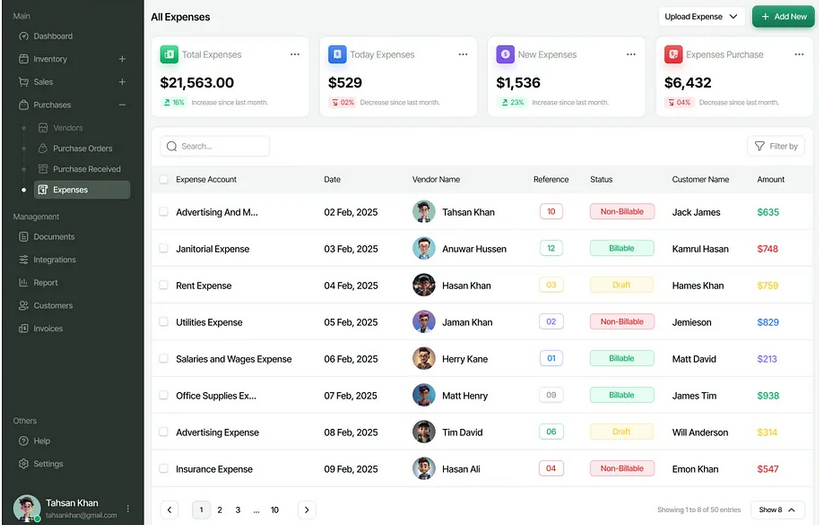

I want to create a Flutter-based desktop application for a jewelry casting machine company, designed to manage inventory, imports, customer data, and AMC (Annual Maintenance Contract) schedules. It features a dashboard overview, a shop section to track foreign imports, detailed inventory management for machines and spare parts, customer records, and an AMC scheduler with 4-month interval tracking. 

Use SQLite for database storage

—------------ Dashboard —---
1. Inventory
	• Machines  available stoke list
    	- based on Name
	•   Spare parts stoke list
    	- based on name

2. Visuals
	- Total sales
	-  mothly sales

3. Reminders
	- AMC schedule (due today)
	- Import delivery status
	- Expiring AMC contracts

—------------   Shop —--------
1. New Import Order
	- Part code
	- name
	- Serial
	- Customer Name
	-  year
	- YNC Inv
	- InvDate
	- price
    	- JPY
    	-  INR
    	-  USD

2.  Request table
	- ID
	- Date
	- Item Name
	- Quantity
	- status
    	- pending
    	-  shiped
    	-  Delivered)
	- Edit  / update Request

3.  Import History
—--------    Inventory     —----------
1. Invetory Table (filter)
	- Name
	- Type (machine)
	- Quantity
	- Unit Price
	- Last Updated
    	- Edit / Delete

2. Filters / Search
	- by name or type
	- filter by
    	- low stock
    	- recently updated
    	- machines only
    	- spare parts only
        	- use multi seletct check box
3. Add New Item
	- Name
	- Type
	- Qunantity
	- Price
	- Notes , specs

4. Low stock alert
	- List reorder items
	- settings
    	- add / edit thresholde
    	- delete thresholde

—----  Customers  —--------------
1. Customer List
	- code
	- Name
	- Country
	- destination
	- tell no.
	- fax
	- Address
	- geo-coordinates

2. Customer Profile
	- name
	- List of machines
    	- ANC dates
    	- - names
    	- - no. of visits
    	- - Expire date

3. New Customer
	- Name
	- Country
	- destination
	- tell no.
	- fax
	- Address
	- geo-coordinates

4. New sold Machinery
	- name
    	- Drop down from (DB)
	- serial no
	- Quantity
	- year
	- Invove Date
	- Price
    	- INR
    	- JPY
    	- USD

—--------  AMC  —-----------
1. Calander View
	- show Vists using numbers on
    	dates

2. Show Selected date
	- List of AMC Visit Cards

3. New AMC contract  (quick access)
4. Re-new AMC contract (quick access)
5. Schedule Emergency Visit

6. Reminders
	- Expiring soon

7. Table View
	- list all AMC contracts
	- filter by Status
    	- active
    	- Expired

Use these features as a guideline and design a professional and clean looking desktop app, with a side bar for navigation.
 
